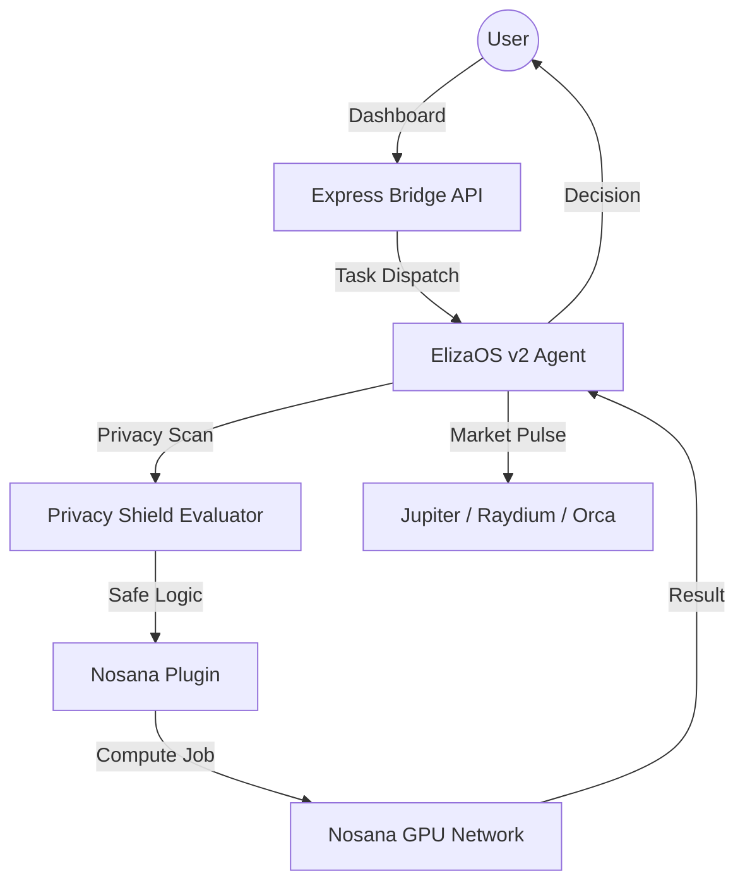

# ⚡ CortexGas: Autonomous Gas Intelligence Engine

[](https://nosana.io)
[](https://github.com/elizaos/elizaos)
[](https://solana.com)
[](https://opensource.org/licenses/ISC)

**CortexGas** is a high-frequency Autonomous Gas Optimizer and Neural Arbitrage Agent. It leverages **ElizaOS v2** for cognitive orchestration and the **Nosana GPU Network (Cortex)** for privacy-shielded, high-performance path optimization. 

Built for the *Superteam Earn Nosana Builders Challenge*, CortexGas solves the dual problem of transaction inefficiency and privacy exposure in decentralized finance.

---

## 👁️ Core Vision

In a world of fragmented liquidity and volatile gas fees, manual execution is obsolete. CortexGas provides:

- **Neural Path Optimization**: Scans Jupter, Raydium, and Orca in parallel to find the most efficient route.
- **Privacy Shield**: Automated PII (Personally Identifiable Information) redaction before any neural processing.
- **Confidential Compute**: Offloads complex simulations to Nosana GPU nodes, ensuring execution logic remains isolated and fast.

---

## 🔥 Key Features

### 1. Multi-Aggregator Gas Duel
CortexGas doesn't just check one DEX. It performs a real-time "duel" between **Jupiter**, **Raydium**, and **Orca**, weighing slippage against gas fees to select the absolute winner for every transaction.

### 2. Neural Forge Dashboard
A premium, real-time dashboard featuring:
- **Monte Carlo Forecaster**: Live prediction of portfolio efficiency.
- **Execution Pulse**: A deep-dive log of every autonomous decision made by the agent.
- **Strategy Monitor**: Real-time tracking of active GPU-powered arbitrage paths.

### 3. TEE-Shielded Execution
Integration with **Nosana (Cortex)** allows the agent to run compute-heavy tasks (like Monte Carlo simulations or high-depth path audits) on decentralized GPU nodes, leveraging Trusted Execution Environments (TEE) mentalities for data isolation.

### 4. Automated Security Audits
Download verifiable PDF audit reports directly from the engine. Each report contains a cryptographic trace of the agent's internal reasoning and security state.

---

## 🛠️ Technical Architecture



---

## 🚀 Quick Start

### Prerequisites
- Node.js v18+
- Solana Wallet (Phantom/Solflare)
- [Nosana API Key](https://nosana.io)

### Installation

1. **Clone and Install**
   ```bash
   git clone https://github.com/your-repo/cortex-gas.git
   cd cortex-gas
   npm install
   ```

2. **Configure Environment**
   Create a `.env` file based on `.env.example`:
   ```env
   NOSANA_API_KEY=your_key_here
   NOSANA_NETWORK=mainnet
   ```

3. **Launch the Engine**
   ```bash
   npm run dev:robust
   ```

4. **Access Dashboard**
   Open `http://localhost:3000` in your browser.

### Cloud Deployment (Nosana GPU Network)
Detailed instructions on how to containerize this agent and host it live on the Nosana decentralized network can be found in the **[Deployment Guide](DEPLOYMENT.md)**. This satisfies the challenge requirement for a Live Nosana deployment URL.

---

## 🧰 Tech Stack

- **Core Engine**: ElizaOS v2 (Alpha)
- **Compute Layer**: Nosana (Cortex) GPU Network
- **Blockchain**: Solana
- **Frontend**: HTML5, TailwindCSS, Lucide Icons, jsPDF
- **Backend API**: Node.js, Express, TypeScript

---

## 📜 License

This project is licensed under the **ISC License**.

---

*CortexGas is an experimental submission for the Superteam Earn Nosana Builders Challenge.*
